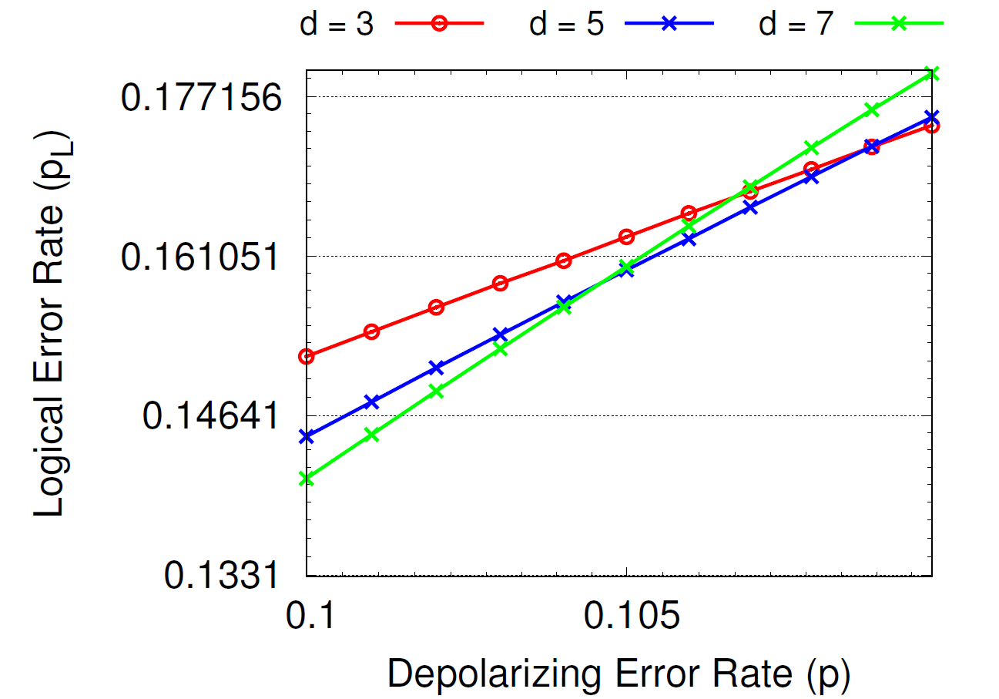
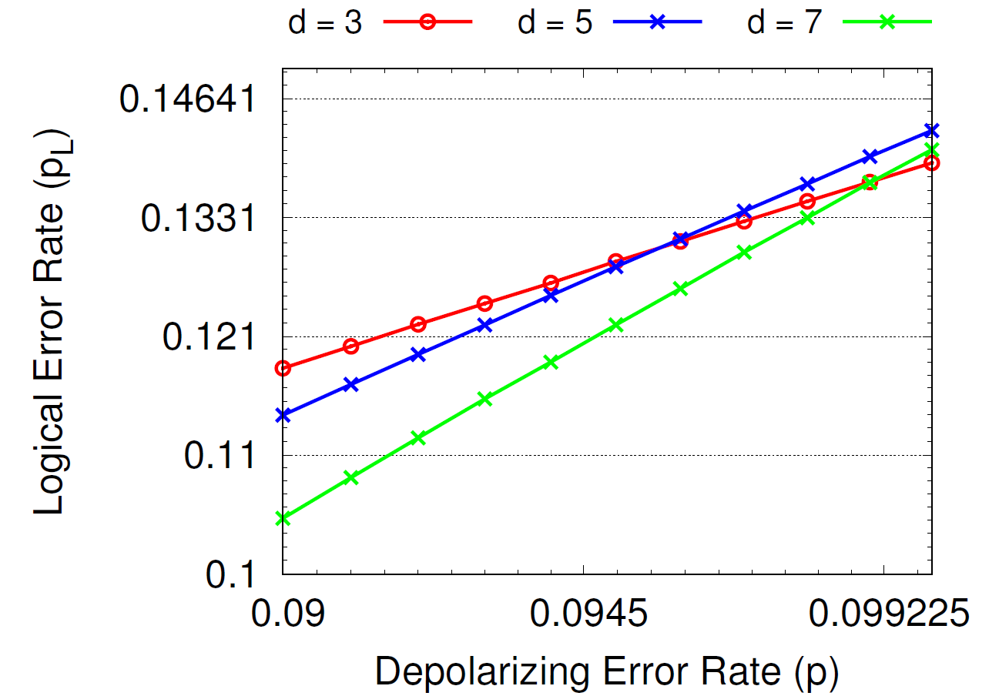

# UF decoder and MWPM decoder

## Conclusion

- They're the same in underlying mechanism, and their difference in decoding threshold (10.9% v.s. 9.8%) may **not** be an evidence of their inequivalence.

## Arguments

### Argument 1: MWPM decoder doesn't have a fixed threshold, even given the same matching graph

There might be some unnoticed arbitrary preference that leads to different decoding threshold of MWPM decoder. A standard MWPM decoder uses Blossom algorithm, which takes a weighted graph as input and output the matching pattern which minimizes the total weight sum. If two matching patterns having exactly the same total weight sum, the Blossom algorithm can give any one of them. I argue, that this arbitrary preference inside the Blossom algorithm can lead to different decoding threshold.

The blossom algorithm takes two inputs:

- the number of nodes `node_num`
- the list of weighted edges `[(a_index, b_index, weight)]`

In a straightforward understanding, it doesn't matter if we change the index of nodes, for example, by reversing all the indexes (`0` -> `node_num-1`, `1` -> `node_num-2`, ..., `node_num-2` -> `1`, `node_num-1` -> `0`) and changing the corresponding weighted edges as well (`[(a_index, b_index, weight)]` -> `[(node_num-1-a_index, node_num-1-b_index, weight)]`). This operation does not change the graph it represents, and it not ever limited in the description of MWPM decoder, so the straightforward understanding is that this operation will not change the decoding threshold, right?

This is not true, after some experiments.

Here is the result before inversing the nodes, d=3 and d=5 intersects at about 10.9%, d=5 and d=7 intersects at about 10.5%.



Here is the result after inversing the nodes, d=3 and d=5 intersects at about 9.6%, d=5 and d=7 intersects at about 10.1%.



I admit that the threshold is moving towards each other, and perhaps for enough large code distance, they might converge to a same value. (I will do further experiments to check this out).

But the point here is rather clear: changing the graph representation shouldn't have influence on the decoding accuracy, **but it actually does** (in a reason, for example, Blossom algorithm may choose to add nodes into alternating tree sequentially, so it might have a preference to match nodes in the front. In the original node order, virtual boundary nodes are at the end, so Blossom algorithm tends to match between error nodes, but in the inversed order, virtual boundary nodes are in the front, so Blossom algorithm tends to match error node to the boundary). 

The code is below, using an option `feature=MWPM_reverse_order` to reverse the nodes' indices

```rust
pub fn safe_minimum_weight_perfect_matching(node_num: usize, input_weighted_edges: Vec<(usize, usize, f64)>) -> Vec<usize> {
    // reverse the nodes' indices
    let weighted_edges = if cfg!(feature="MWPM_reverse_order") {
        input_weighted_edges.iter().map(|(a, b, cost)| {
            (node_num - 1 - a, node_num - 1 - b, *cost)
        }).collect()
    } else {
        input_weighted_edges
    };
    // normal matching
    let edge_num = weighted_edges.len();
    let mut edges = Vec::with_capacity(2 * edge_num);
    let mut weights = Vec::with_capacity(edge_num);
    for i in 0..edge_num {
        let (i, j, weight) = weighted_edges[i];
        edges.push(i as c_int);
        edges.push(j as c_int);
        assert!(i < node_num && j < node_num);
        weights.push(weight);
    }
    let mut output = Vec::with_capacity(node_num);
    unsafe {
        minimum_weight_perfect_matching(node_num as c_int, edge_num as c_int, edges.as_ptr(), weights.as_ptr(), output.as_mut_ptr());
        output.set_len(node_num);
    }
    let output: Vec<usize> = output.iter().map(|x| *x as usize).collect();
    // recover the nodes' indices
    if cfg!(feature="MWPM_reverse_order") {
        let mut result = output.iter().map(|a| {
            node_num - 1 - a
        }).collect::<Vec<_>>();
        result.reverse();
        result
    } else {
        output
    }
}
```

### update 2022.6.30

The command of reproducing the above results are

```sh

# targeting 1e-3 relative error

cargo run --release -- tool benchmark [3] [0] [0.1] -e4000000 -p0 --decoder mwpm --decoder_config '{"pcmg":true}'
cargo run --release --features MWPM_reverse_order -- tool benchmark [3] [0] [0.1] -e4000000 -p0 --decoder mwpm --decoder_config '{"pcmg":true}'

cargo run --release -- tool benchmark [5] [0] [0.1] -e4000000 -p0 --decoder mwpm --decoder_config '{"pcmg":true}'
cargo run --release --features MWPM_reverse_order -- tool benchmark [5] [0] [0.1] -e4000000 -p0 --decoder mwpm --decoder_config '{"pcmg":true}'

cargo run --release -- tool benchmark [7] [0] [0.1] -e4000000 -p0 --decoder mwpm --decoder_config '{"pcmg":true}'
cargo run --release --features MWPM_reverse_order -- tool benchmark [7] [0] [0.1] -e4000000 -p0 --decoder mwpm --decoder_config '{"pcmg":true}'

cargo run --release -- tool benchmark [9] [0] [0.1] -e4000000 -p0 --decoder mwpm --decoder_config '{"pcmg":true}'
cargo run --release --features MWPM_reverse_order -- tool benchmark [9] [0] [0.1] -e4000000 -p0 --decoder mwpm --decoder_config '{"pcmg":true}'

```

